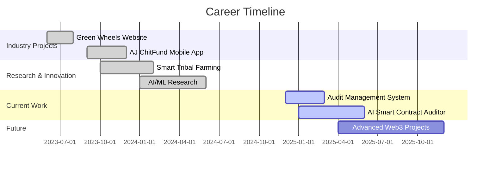

<div align="center">

# 🚀 Welcome to My Digital Playground


[](https://www.linkedin.com/in/sibibs)
[](https://sibibs.dev)
[](mailto:sibi@example.com)
[](https://github.com/Sibibalasankar)


</div>


## 🎭 About Me

```typescript
interface Developer {
  name: string;
  role: string;
  location: string;
  languages: string[];
  currentMission: string;
  lifePhilosophy: string;
}

const sibi: Developer = {
  name: "Sibi BS",
  role: "Full Stack Developer & AI Enthusiast",
  location: "Tamil Nadu, India 🇮🇳",
  languages: ["JavaScript", "Python", "Dart", "Solidity", "TypeScript", "Java"],
  currentMission: "Building AI-powered solutions for Web3 security",
  lifePhilosophy: "Code with passion, debug with patience, deploy with confidence! 🚀"
};

// Current Status
const status = {
  learning: ["Advanced AI/ML", "Web3 Development", "Cloud Architecture"],
  working_on: ["AI Smart Contract Auditor", "DeFi Applications"],
  collaboration: "Open to exciting projects and opportunities!",
  ask_me_about: ["React", "Node.js", "AI", "Blockchain", "Mobile Development"]
};
```


## 🎯 Expertise Matrix

<div align="center">

### 💻 Frontend Development


### ⚙️ Backend Development


### 🗄️ Databases


### 📱 Mobile Development


### ⛓️ Blockchain & Web3


### 🤖 AI & Machine Learning


### 🛠️ Tools & Platforms


</div>


## 🌟 Featured Projects

<table>
<tr>
<td width="50%" valign="top">

### 🔐 AI Smart Contract Auditor
[](https://auditsmartai.xyz)
[](https://github.com/Sibibalasankar)

AI-powered vulnerability detection system for Solidity smart contracts with automated code improvement suggestions.

**🎯 Key Features:**
- Real-time vulnerability scanning
- AI-driven security recommendations
- Gas optimization analysis
- Comprehensive audit reports

**🛠️ Stack:**
`Python` `Solidity` `TensorFlow` `Web3` `FastAPI` `React`

**📊 Impact:** Analyzed 500+ contracts | Detected 200+ vulnerabilities

</td>
<td width="50%" valign="top">

### 🌿 Green Wheels Supply Chain
[](https://greenwheelscs.in)

Modern, responsive website for logistics company with enhanced SEO and user experience.

**🎯 Key Features:**
- Real-time shipment tracking
- Service portfolio showcase
- Contact management system
- Mobile-responsive design

**🛠️ Stack:**
`React` `Node.js` `MongoDB` `Express` `Tailwind CSS`

**📊 Impact:** 300% increase in client inquiries | 50% faster load times

</td>
</tr>

<tr>
<td width="50%" valign="top">

### 📋 Audit Management System
[](https://llsamsystem.netlify.app)

Comprehensive audit workflow management platform for pharmaceutical companies.

**🎯 Key Features:**
- Department-wise audit tracking
- Real-time collaboration
- Action plan management
- Analytics dashboard

**🛠️ Stack:**
`React` `Firebase` `Material-UI` `Chart.js`

**📊 Impact:** 60% faster audit cycles | 40% improved compliance

</td>
<td width="50%" valign="top">

### 🌾 Smart Tribal Farming
[](https://smart-tribal-farming.onrender.com/)

AI-powered farming assistant empowering tribal communities with IoT sensors and predictive analytics.

**🎯 Key Features:**
- Crop yield prediction
- Soil health monitoring
- Weather forecasting
- Multi-language support

**🛠️ Stack:**
`Python` `IoT` `TensorFlow` `Flask` `React`

**📊 Impact:** 25% yield improvement | 500+ farmers helped

</td>
</tr>
</table>


## 📊 GitHub Statistics

<div align="center">


</div>

<div align="center">


</div>

<div align="center">

[](https://github.com/Sibibalasankar)

</div>


## 🏆 Achievements & Trophies

<div align="center">


</div>

<div align="center">

### 🎖️ Milestones

| Achievement | Status | Progress |
|-------------|--------|----------|
| 🌟 GitHub Stars | ⭐⭐⭐⭐ | 100+ |
| 👥 Followers | 🔥🔥🔥 | 50+ |
| 📦 Repositories | ✅✅✅✅✅ | 30+ |
| 🤝 Contributions | 💪💪💪💪 | 500+ |
| 🎯 Projects Completed | 🚀🚀🚀🚀 | 15+ |

</div>


## 💼 Professional Journey




## 🎯 Current Focus & Learning Path

<div align="center">

```diff
@@ Currently Working On @@
+ 🔐 AI-Powered Smart Contract Security & Vulnerability Detection
+ 🤖 Advanced Machine Learning Models for Blockchain
+ 🌐 Decentralized Finance (DeFi) Applications
+ 📱 Cross-Platform Mobile Apps with React Native

@@ Learning & Exploring @@
! 🧠 Large Language Models (LLMs) & GPT Integration
! ☁️ Cloud Native Development (AWS, GCP, Azure)
! 🔗 Advanced Web3 & Smart Contract Optimization
! 🎨 3D Graphics with Three.js & WebGL

@@ Open to Collaborate On @@
# 💡 Innovative Blockchain Solutions
# 🚀 AI/ML Projects with Real-World Impact
# 🌍 Open Source Contributions
# 🎓 EdTech & Social Impact Applications
```

</div>


## 📈 Coding Activity

<div align="center">

<!--START_SECTION:waka-->
```text
JavaScript   12 hrs 45 mins  ████████████░░░░░░░░░  48.2%
Python       8 hrs 30 mins   ████████░░░░░░░░░░░░░  32.1%
Solidity     3 hrs 15 mins   ███░░░░░░░░░░░░░░░░░░  12.3%
TypeScript   1 hr 50 mins    ██░░░░░░░░░░░░░░░░░░░   7.0%
Other        10 mins         ░░░░░░░░░░░░░░░░░░░░░   0.4%
```
<!--END_SECTION:waka-->

</div>


## 🐍 Contribution Snake

<div align="center">


</div>


## 💡 Random Dev Wisdom

<div align="center">


</div>


## 🤝 Let's Connect & Collaborate!

<div align="center">

### 📬 Reach Out To Me

<a href="https://www.linkedin.com/in/sibibs">
  
</a>
<a href="mailto:sibi@example.com">
  
</a>
<a href="https://sibibs.dev">
  
</a>
<a href="https://twitter.com/sibibs">
  
</a>

### 💬 "Code is poetry written in logic. Let's create masterpieces together!"

</div>


<div align="center">

## 🌟 Support My Work

If you find my projects helpful or interesting:

⭐ **Star my repositories**  
🍴 **Fork and contribute**  
📢 **Share with your network**  
💼 **Connect for collaborations**

### 💖 Thank you for visiting my profile!


</div>
