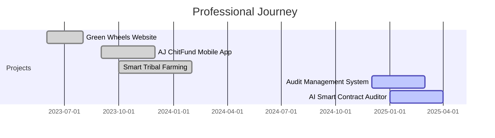

<h1 align="center">
  
</h1>

<div align="center">
  
</div>

<p align="center">
  
</p>

<div align="center">
  
[](https://www.linkedin.com/in/sibibs)
[](https://sibibs.dev)
[](mailto:sibi@example.com)
[](https://github.com/Sibibalasankar)

</div>


## 💫 About Me

```javascript
const sibi = {
    code: ["JavaScript", "Python", "Dart", "Solidity", "TypeScript"],
    technologies: {
        frontEnd: {
            js: ["React", "Next.js"],
            css: ["Tailwind", "Bootstrap", "Material-UI"]
        },
        backEnd: {
            js: ["Node.js", "Express"],
            python: ["Flask", "FastAPI"]
        },
        mobile: ["React Native"],
        databases: ["MongoDB", "Firebase", "PostgreSQL"],
        blockchain: ["Solidity", "Web3.js", "Ethers.js"],
        ai: ["TensorFlow", "PyTorch", "Langchain"]
    },
    currentFocus: "AI-Powered Smart Contract Security",
    funFact: "I debug with console.log() and I'm not ashamed! 😄"
};
```


## 🚀 Featured Projects

<table>
<tr>
<td width="50%">

### 🌿 Green Wheels Supply Chain
[](https://greenwheelscs.in)

**Web Development** • *Green Wheels Chain Supply*

Built and launched the official website to showcase logistics services and improve client reach. Enhanced online presence with modern design and SEO optimization.

**Tech Stack:** `React` `Node.js` `MongoDB`

</td>
<td width="50%">

### 🔐 AI Smart Contract Auditor
[](https://auditsmartai.xyz)

**AI + Blockchain** • *Layer One X, Australia*

Detects vulnerabilities in Solidity smart contracts using AI and suggests secure code improvements. Automated security analysis powered by machine learning.

**Tech Stack:** `Python` `Solidity` `AI/ML` `Web3`

</td>
</tr>

<tr>
<td width="50%">

### 📋 Audit Management System
[](https://llsamsystem.netlify.app)

**Application Development** • *Lakshmi Life Sciences*

A responsive web app for managing audit plans, observations, and action reports across departments. Streamlined workflow with real-time collaboration.

**Tech Stack:** `React` `Firebase` `Material-UI`

</td>
<td width="50%">

### 🌾 Smart Tribal Farming
[](https://smart-tribal-farming.onrender.com/)

**AI + IoT Project** • *Research Project*

AI-based farming assistant for tribal communities, integrating sensors and prediction models for crop management. Empowering farmers with technology.

**Tech Stack:** `Python` `IoT` `TensorFlow` `Flask`

</td>
</tr>
</table>


## 🛠️ Tech Stack & Tools

<div align="center">

### Languages


### Frontend


### Backend & Database


### Mobile & Others


</div>


## 📊 GitHub Analytics

<div align="center">
  


</div>

<div align="center">
  


</div>

<div align="center">
  


</div>


## 🏆 GitHub Trophies

<div align="center">
  
</div>


## 💼 Work Experience Timeline




## 📈 Contribution Graph

<div align="center">
  
[](https://github.com/Sibibalasankar)

</div>


## 🎯 Current Focus

<div align="center">

```diff
+ 🔐 AI-Powered Smart Contract Security & Auditing
+ 🤖 Building Intelligent Web Applications with AI
+ 🌐 Exploring Web3 & Decentralized Technologies
+ 📱 Crafting Beautiful Mobile Experiences
```

</div>


## 🐍 Contribution Activity

<picture>
  <source media="(prefers-color-scheme: dark)" srcset="https://raw.githubusercontent.com/Sibibalasankar/Sibibalasankar/output/github-contribution-grid-snake-dark.svg">
  <source media="(prefers-color-scheme: light)" srcset="https://raw.githubusercontent.com/Sibibalasankar/Sibibalasankar/output/github-contribution-grid-snake.svg">
  
</picture>

*Note: To enable the snake animation, you'll need to set up a GitHub Action. [Learn how here](https://github.com/Platane/snk)*


## ✨ Random Dev Quote

<div align="center">
  


</div>


<div align="center">
  
</div>

<div align="center">
  
### 💙 Show some love by starring ⭐ some repositories!


**"Code is like humor. When you have to explain it, it's bad!"** 😄

</div>
